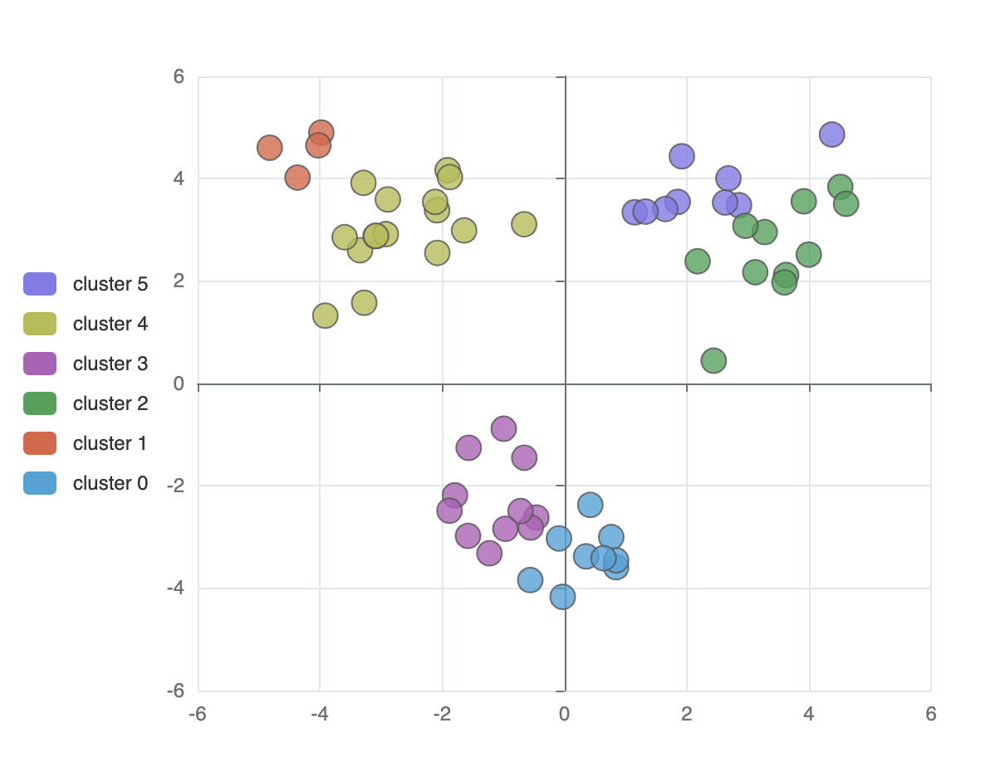
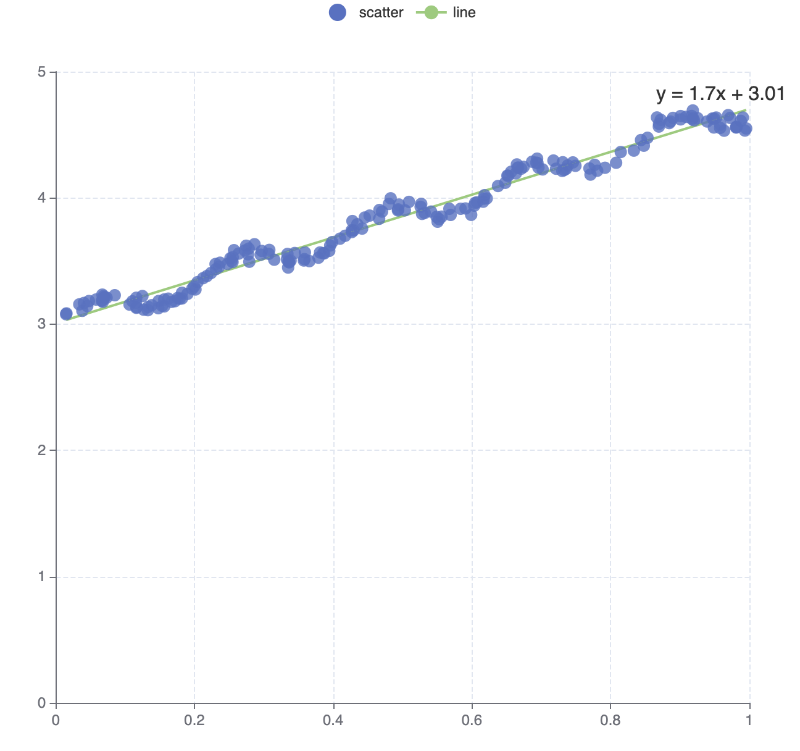
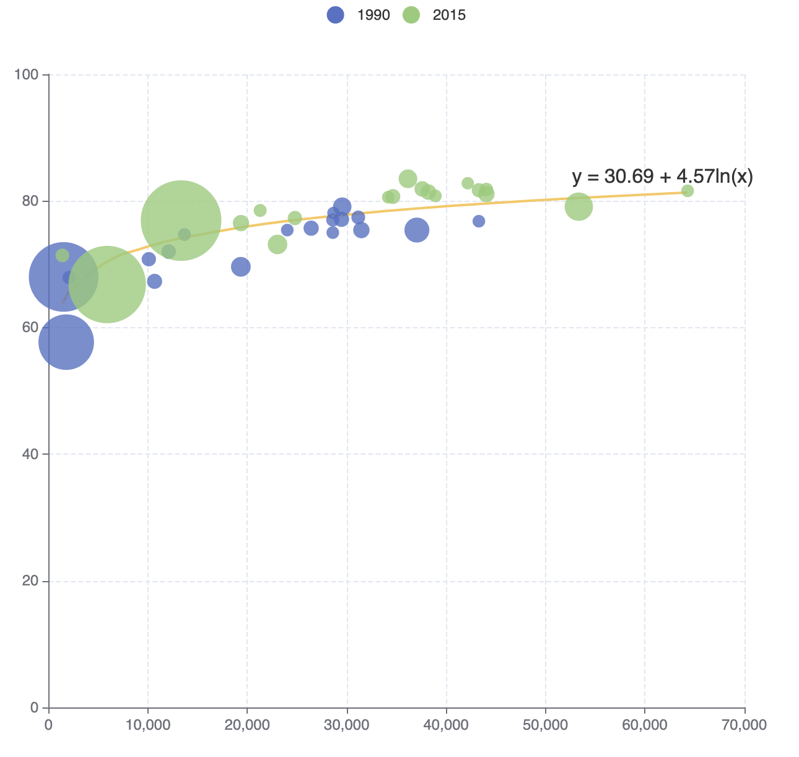
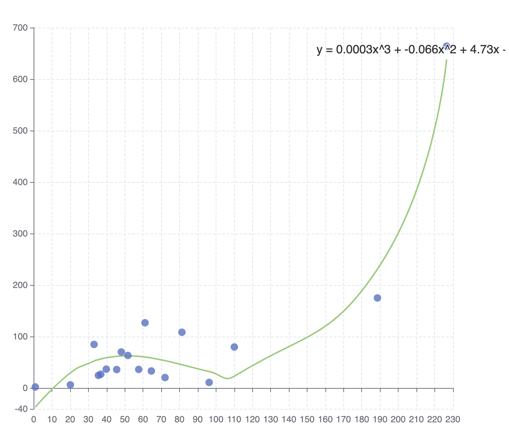

# ecStat

A statistical and data mining tool for [ECharts](https://github.com/ecomfe/echarts). You can use it to analyze data and then visualize the results with ECharts, or just use it to process data.

It works both in node.js and in the browser.

## Installing

If you use npm, you can install it with:

```sh
 npm install echarts-stat
 ```

Otherwise, download this tool from [dist directory](https://github.com/ecomfe/echarts-stat/tree/master/dist):

```html
<script src='./dist/ecStat.js'></script>
<script>

var result = ecStat.clustering.hierarchicalKMeans(data, clusterNumber, false);

</script>
```

## API Reference

* [Histogram](#histogram)
* [Clustering](#clustering)
* [Regression](#regression)
* [Statistics](#statistic)

### Histogram

A histogram is a graphical representation of the distribution of numerical data. It is an estimate of the probability distribution of a quantitative variable. It is a kind of bar graph. To construct a histogram, the first step is to "bin" the range of values - that is, divide the entire range of values into a series of intervals - and then count how many original sample values fall into each interval. The bins are usually specified as consecutive, non-overlapping intervals of a variable. Here the bins(intervals) must be adjacent, and are of equal size.

#### Syntax

```js
var bins = ecStat.histogram(data, binMethod);
```

##### Parameter

* `data` - `Array<number>`. Data samples of numbers.

	```js
	var data = [8.6, 8.8, 10.5, 10.7, 10.8, 11.0, ... ];
	```

* `binMethod` - `string`. There are four methods to calculate the number of bin, which are `squareRoot`, `scott`, `freedmanDiaconis`, and `sturges`. Of course, there is no "best" number of bin, and different bin size can reveal different feature of data.

	 * `squareRoot` - This is the default method, which is also used by Excel histogram. Returns the number of bin according to [Square-root choice](https://en.wikipedia.org/wiki/Histogram#Mathematical_definition):
	 	```js
		var bins = ecStat.histogram(data);
		```

	* `scott` - Returns the number of bin according to [Scott's normal reference Rule](https://en.wikipedia.org/wiki/Histogram#Mathematical_definition):
		```js
		var bins = ecStat.histogram(data, 'scott');
		```

	* `freedmanDiaconis` - Returns the number of bin according to [The Freedman-Diaconis rule](https://en.wikipedia.org/wiki/Histogram#Mathematical_definition):
		```js
		var bins = ecStat.histogram(data, 'freedmanDiaconis');
		```

	* `sturges` - Returns the number of bin according to [Sturges' formula](https://en.wikipedia.org/wiki/Histogram#Mathematical_definition):
		```js
		var bins = ecStat.histogram(data, 'sturges');
		```

##### Return Value

* `bins` - `Object`. Contain detailed messages of each bin and data used for [ECharts](https://github.com/ecomfe/echarts) to draw the histogram.
	* `bins.bins` - `Array.<Object>`. An array of bins, where each bin is an object, containing three attributes:
		* `x0` - `number`. The lower bound of the bin (inclusive).
		* `x1` - `number`. The upper bound of the bin (exclusive).
		* `sample` - `Array.<number>`. Containing the associated elements from the input data.
	* `bins.data` - `Array.<Array.<number>>`. Used for bar chart to draw the histogram, each bin data is an array not only containing the mean value of `x0` and `x1`, but also the length of `sample`, which is the number of sample values in this bin.
	* `bins.customData` - `Array.<Array<number>>`. Used for custom chart to draw the histogram, each custom data is an array not only containing the `x0` and `x1`, but also the length of `sample`, which is the number of sample values in this bin.  

#### Examples

 This example using ECharts custom chart to draw the histogram, which is the best type of chart we recommend.

```html
<script src='https://cdn.bootcss.com/echarts/3.4.0/echarts.js'></script>
<script src='./dist/ecStat.js'></script>
<script>

var bins = ecStat.histogram(data);
var option = {
	...
	series: [{
		type: 'custom',
		...
	}],
	...
}

</script>
```


[Run](http://gallery.echartsjs.com/editor.html?c=xBk5VZddJW)


### Clustering

Clustering can divide the original data set into multiple data clusters with different characteristics. And through [ECharts](https://github.com/ecomfe/echarts), you can visualize the results of clustering, or visualize the process of clustering.

#### Syntax
```
var result = ecStat.clustering.hierarchicalKMeans(data, clusterNumber, stepByStep);
```
##### Parameter

* `data` － `Array.<Array.<number>>`. Two-dimensional numeric array, each data point can have more than two numeric attributes in the original data set. In the following example, `data[0]` is called `data point` and `data[0][1]` is one of the numeric attributes of `data[0]`.

  ```js
  var data = [
		[1, 2, 3, 4, 5],
		[6, 7, 8, 9, 10],
		[11, 12, 13, 14, 15],
		...
	    ];
  ```
* `clusterNumer` － `number`. The number of clusters generated. **Note that it has to be greater than 1.**
* `stepByStep` － `boolean`. Control whether doing the clustering step by step

##### Return Value

* `result` － `Object`. Including the centroids, clusterAssment, and pointsInCluster. For Example:

	```js
	result.centroids = [

		[-0.460, -2.778],
		[2.934, 3.128],
	    	...
	];

	// Indicate which cluster each data point belonging to, and the distance to cluster centroids
	result.clusterAssment = [

		[1, 0.145],
		[2, 0.680],
		[0, 1.022],
		...
	];

	// Concrete data point in each cluster
	result.pointsInCluster = [
		[
			[0.335, -3.376],
			[-0.994, -0.884],
			...
		],
		...
	];
	```

#### Examples

You can not only do cluster analysis through this interface, but also use [ECharts](https://github.com/ecomfe/echarts) to visualize the results.

**Note: the clustering algorithm can handle multiple numeric attributes, but for the convenience of visualization, two numeric attributes are chosen here as an example.**

##### Directly visualize the final results of clustering

```html
<script src='https://cdn.bootcss.com/echarts/3.4.0/echarts.js'></script>
<script src='./dist/ecStat.js'></script>
<script>

var clusterNumber = 3;
var result = ecStat.clustering.hierarchicalKMeans(data, clusterNumber, false);

</script>
```



[Run](http://gallery.echartsjs.com/editor.html?c=xSkBOEaGtx)

##### Visualize the process of clustering

```html
<script src='https://cdn.bootcss.com/echarts/3.4.0/echarts.js'></script>
<script src='./dist/ecStat.js'></script>
<script>

var clusterNumber = 6;
var result = ecStat.clustering.hierarchicalKMeans(data, clusterNumber, true);

</script>
```


[Run](http://gallery.echartsjs.com/editor.html?c=xHyr-esMtg)


### Regression

Regression algorithm can according to the value of the dependent and independent variables of the data set, fitting out a curve to reflect their trends. The regression algorithm here only supports two numeric attributes.

#### Syntax
```
var myRegression = ecStat.regression(regressionType, data, order);
```
##### Parameters

* `regressionType` - `string`. There are four types of regression, whice are `'linear'`, `'exponential'`, `'logarithmic'`, `'polynomial'`.
* `data` - `Array.<Array.<number>>`. Two-dimensional numeric array, Each data object should have two numeric attributes in the original data set. For Example:

	```js
	var data = [

		[1, 2],
		[3, 5],
		...
	];
	```
* `order` - `number`. The order of polynomial. If you choose other types of regression, you can ignore it.

##### Return Value

* `myRegression` - `Object`. Including points, parameter, and expression. For Example:

	```js
	myRegression.points = [
		[1, 2],
		[3, 4],
		...
	];

	// This is the parameter of linear regression, for other types, it shoule be a little different
	myRegression.parameter = {
		gradient: 1.695,
		intercept: 3.008
	};

	myRegression.expression = 'y = 1.7x + 3.01';
	```

#### Examples

You can not only do regression analysis through this interface, you can also use [ECharts](https://github.com/ecomfe/echarts) to visualize the results.

##### Linear Regression

```html
<script src='https://cdn.bootcss.com/echarts/3.4.0/echarts.js'></script>
<script src='./dist/ecStat.js'></script>
<script>

var myRegression = ecStat.regression('linear', data);

</script>
```



[Run](http://gallery.echartsjs.com/editor.html?c=xS1bQ2AMKe)

##### Exponential Regression

```html
<script src='https://cdn.bootcss.com/echarts/3.4.0/echarts.js'></script>
<script src='./dist/ecStat.js'></script>
<script>

var myRegression = ecStat.regression('exponential', data);

</script>
```


[Run](http://gallery.echartsjs.com/editor.html?c=xHyaNv0fFe&v=5)

##### Logarithmic Regression

```html
<script src='https://cdn.bootcss.com/echarts/3.4.0/echarts.js'></script>
<script src='./dist/ecStat.js'></script>
<script>

var myRegression = ecStat.regression('logarithmic', data);

</script>
```



[Run](http://gallery.echartsjs.com/editor.html?c=xry3aWkmYe)

##### Polynomial Regression

```html
<script src='https://cdn.bootcss.com/echarts/3.4.0/echarts.js'></script>
<script src='./dist/ecStat.js'></script>
<script>

var myRegression = ecStat.regression('polynomial', data, 3);

</script>
```



[Run](http://gallery.echartsjs.com/editor.html?c=xB16yW0MFl)


### Statistics

This interface provides basic summary statistical services.

#### ecStat.statistics.deviation()

##### Syntax
```
var sampleDeviation = ecStat.statistics.deviation(dataList);
```
##### Parameter

* `dataList` : `Array.<number>`

##### Return Value

* `sampleDeviation`: `number`. Return the deviation of the numeric array *dataList*. If the *dataList* is empty or the length less than 2, return 0.


#### ecStat.statistics.sampleVariance()

##### Syntax
```
var varianceValue = ecStat.statistics.sampleVariance(dataList);
```
##### Parameter

* `dataList` : `Array.<number>`

##### Return Value

* `varianceValue`: `number`. Return the variance of the numeric array *dataList*. If the *dataList* is empty or the length less than 2, return 0. 


#### ecStat.statistics.quantile()

##### Syntax
```
var quantileValue = ecStat.statistics.quantile(dataList, p);
```
##### Parameter

* `dataList` : `Array.<number>`. Sorted array of numbers.
* `p`: `number`.  where 0 =< *p* <= 1. For example, the first quartile at p = 0.25, the seconed quartile at p = 0.5(same as the median), and the third quartile at p = 0.75.

##### Return Value

* `quantileValue`: `number`. Return the *p*-quantile of the sorted array of numbers. If p <= 0 or the length of *dataList* less than 2, return the first element of the sorted array; if p >= 1, return the last element of the sorted array; If *dataList* is empty, return 0.


#### ecStat.statistics.max()

##### Syntax
```
var maxValue = ecStat.statistics.max(dataList);
```
##### Parameter

* `dataList` : `Array.<number>`

##### Return Value

* `maxValue`: `number`. The maximum value of the *dataList*.


#### ecStat.statistics.min()

##### Syntax
```
var minValue = ecStat.statistics.min(dataList);
```
##### Parameter

* `dataList` : `Array.<number>`

##### Return Value

* `minValue`: `number`. The minimum value of the *dataList*.


#### ecStat.statistics.mean()

##### Syntax
```
var meanValue = ecStat.statistics.mean(dataList);
```
##### Parameter

* `dataList` : `Array.<number>`

##### Return Value

* `meanValue`: `number`. The average of the *dataList*.


#### ecStat.statistics.median()

##### Syntax
```
var medianValue = ecStat.statistics.median(dataList);
```
##### Parameter

* `dataList` : `Array.<number>`. Sorted array of numbers

##### Return Value

* `medianValue`: `number`. The median of the *dataList*.


#### ecStat.statistics.sum()

##### Syntax
```
var sumValue = ecStat.statistics.sum(dataList);
```
##### Parameter

* `dataList` : `Array.<number>`

##### Return Value

* `sumValue`: `number`. The sum of the *dataList*.


